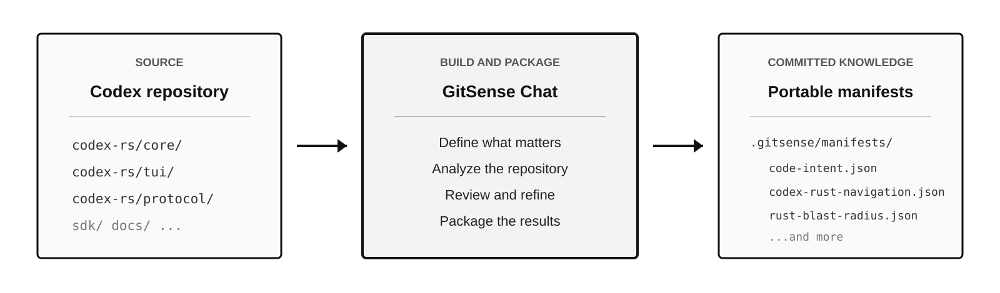
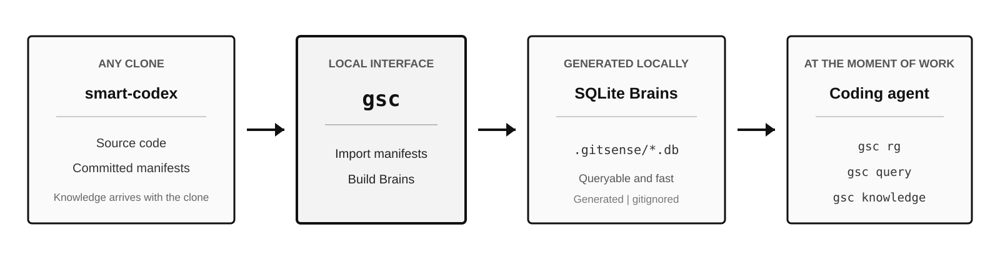

# smart-codex

**See what changes when a coding agent can ask a large repository what matters.**

This is the [OpenAI Codex](https://github.com/openai/codex) codebase with GitSense knowledge committed alongside it. Follow one realistic task to see how an agent sorts through a noisy search, checks what depends on a file, and starts with lessons from earlier work.

## Build Repository Knowledge



[GitSense Chat](https://github.com/gitsense/chat) was used to analyze Codex and package several kinds of repository knowledge. The results live in `.gitsense/manifests/` as plain JSON and travel with the code.

## Use It Locally



Once those files are committed, GitSense Chat is no longer in the path. Anyone who clones this repository can use `gsc` to build local SQLite Brains and make the knowledge available to a coding agent. At this point, the user and agent only need `gsc`.

## One Task, Three Better Decisions

The walkthrough follows one reasonable request:

> Add a new slash command.

Codex contains thousands of files. An agent can still search the whole repository quickly, but a fast search does not tell it which matches matter, which are near misses, or what earlier work already discovered.

### 1. Understand the Search Before Opening Files

Plain ripgrep currently finds 144 files containing `slash`:

```bash
rg -l slash | wc -l
```

Instead of loading those matches, ask your coding agent:

> Search for slash commands, but first tell me what the matching files are for and when I should skip them.

The agent can use the Rust Navigation Brain:

```bash
gsc rg slash \
  --db codex-rust-navigation \
  --summary \
  --fields purpose,open_when,skip_when
```

The metadata separates different kinds of matches before the agent opens them:

| File | What the agent learns |
| :--- | :--- |
| `chatwidget/slash_dispatch.rs` | Open when adding or changing slash-command behavior and routing. |
| `bottom_pane/command_popup.rs` | Relevant to popup filtering and visibility, not command execution. |
| `git-utils/src/baseline.rs` | A Git baseline utility whose own guidance says to skip it for slash-command work. |

Search found the files. Repository knowledge helps the agent judge them.

### 2. Check What Earlier Work Learned

Before changing anything, ask your coding agent:

> Check whether this repository has any lessons about adding a slash command. Do not make changes yet.

After `gsc experts init`, the agent knows this repository has a Lessons Brain and how to query it. The saved lesson says:

- Add the command variant in `codex-rs/tui/src/slash_command.rs`.
- Handle it in `codex-rs/tui/src/chatwidget/slash_dispatch.rs`.
- A variant can compile and appear in the UI while doing nothing if the dispatch arm is missing.
- Keep enum order based on popup presentation, not alphabetical order.

The lesson turns a broad search into a known two-file change and surfaces a mistake the compiler may not catch.

### 3. Check the Blast Radius

Before editing the command definition, ask:

> What depends on slash_command.rs, and how risky is it to change?

The agent queries the Rust Blast Radius Brain:

```bash
gsc query \
  --db rust-blast-radius \
  --glob "codex-rs/tui/src/slash_command.rs" \
  --fields role,coupling_risk,exports_to
```

The file is marked `defines-api` with high coupling risk. Five files depend on it, including command parsing, popup filtering, command visibility, and the main chat surface. The agent knows what may need verification before it edits the definition.

## Try It

Install `gsc`, clone the repository, and build the Brains used above:

```bash
# Read the install script before running it
curl https://raw.githubusercontent.com/gitsense/chat/refs/heads/main/install.sh | bash

git clone https://github.com/gitsense/smart-codex
cd smart-codex

gsc manifest import .gitsense/manifests/codex-rust-navigation.json
gsc manifest import .gitsense/manifests/rust-blast-radius.json
gsc lessons build --target repo
```

Then ask your coding agent:

```text
Run `gsc experts init`, then investigate how you would add a slash command.
Check repository lessons and blast radius before proposing changes.
```

`gsc experts init` tells the agent which Brains are available and how to query them. You can keep speaking to the agent in plain language from there.

## Keep What the Next Agent Should Know

The slash-command lesson exists because an earlier session saved it. When your work uncovers something that should not be rediscovered, tell the agent:

> Save what we learned about adding a slash command as a repository lesson.

`gsc` gives the agent a structured and validated way to record it. Repository lessons live in `.gitsense/lessons/records.jsonl`, so everyone who clones the repository inherits them.

## Explore the Brains

This repository includes five GitSense Chat manifests:

| Brain | A question it can help answer |
| :--- | :--- |
| `code-intent` | Which files are responsible for this behavior? |
| `agent-file-triage` | Which matching files should I open or skip? |
| `codex-rust-navigation` | Where are the entry points, dispatchers, and runtime paths for this Rust task? |
| `rust-blast-radius` | What depends on this Rust file before I change it? |
| `implicit-todos` | Where do comments describe unfinished work without writing `TODO`? |

Import another Brain with its committed manifest:

```bash
gsc manifest import .gitsense/manifests/implicit-todos.json
```

Then ask your agent a matching question. It can inspect the Brain and choose the fields it needs.

## About This Repository

This is a GitSense learning repository built from a copy of OpenAI Codex. It is not affiliated with or endorsed by OpenAI. To use Codex, report an issue, or contribute, visit [openai/codex](https://github.com/openai/codex).

- [Knowledge discovery and topics](docs/knowledge-discovery.md)
- [smart-ripgrep](https://github.com/gitsense/smart-ripgrep) shows the same workflow on a smaller codebase.
- [GitSense CLI](https://github.com/gitsense/gsc-cli) records and delivers repository knowledge.
- [GitSense Chat](https://github.com/gitsense/chat) builds and refines repository knowledge at scale.

## License

The Codex source retains its upstream licensing. See [LICENSE](LICENSE) and [NOTICE](NOTICE).
